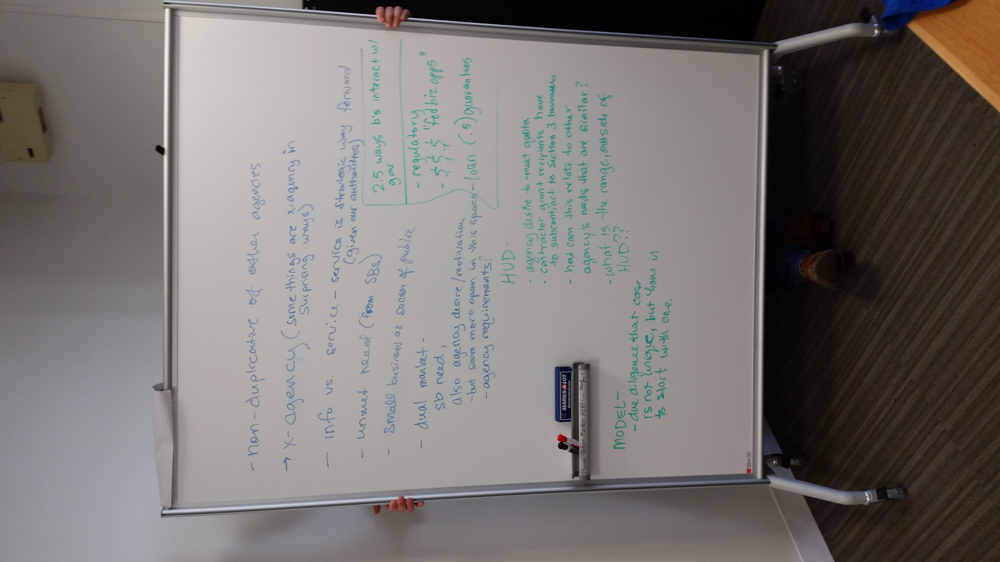
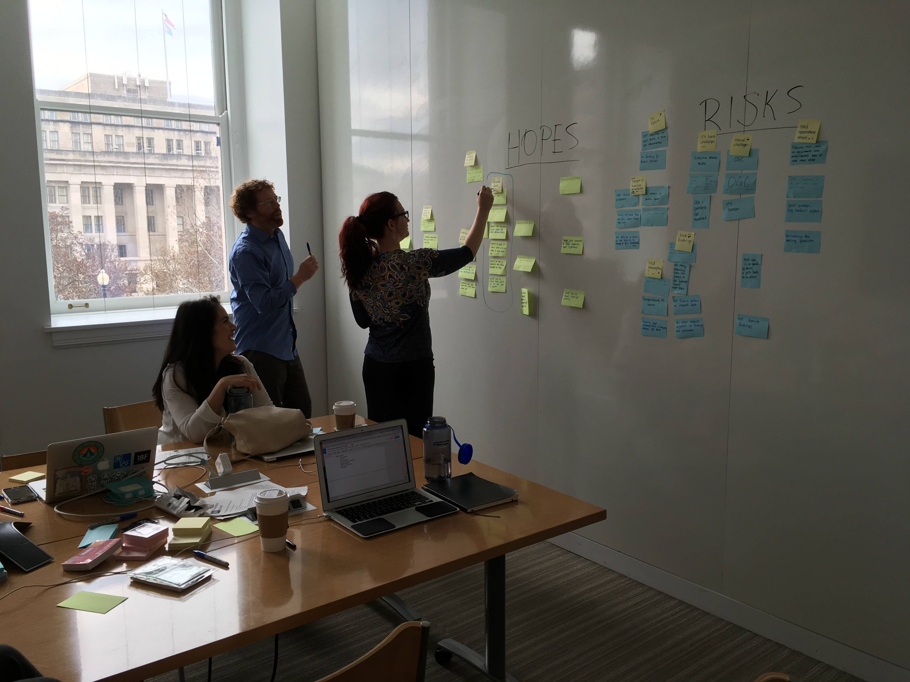

3/1/2017: The short term tl;dr is that we’re going to focus this next week on answering the question – does the grants to local orgs > prime K > sub K pattern (the second leg of this chart) repeat across three or more agencies? 

 

# OPP and small business strategy

We weren’t sure what to title this session, and it was less about strategy and more about learning more about what kind of role OPP envisions for itself within the small business space. We had a wide ranging discussion but here are the key points that stood out: 

- In terms of mission fit, 
  - TTS’ broader mission is to help modernize things, USAGov is about providing information about the federal government to the general public
  - GSA provides cross agency services, and we know multiple agencies provide services to small businesses. Is there a way we can help them? 
- Additionally, we may be better positioned than other agencies to execute on something that actually provides value, and we are better positioned to pay for it. 
- We want to be careful we aren’t mindlessly duplicating something that other agencies are already doing. 
- Would also like success metrics – have a way of showing that what we’re doing can have impact. (Carolyn’s note – these often emerge closer to when an idea for a product or service takes place, after discovery). 
- Benefit to the public – improved services/information for small businesses to earn grants/contracts/etc from gov. (Carolyn’s note – potential side benefit could be cost savings, if it attracts better and/or more efficient businesses) 
- Benefit to OPP – 
  - Partial cost recoverability would be a huge plus for any potential projects in this area. 
  - We can (and would like to) explore opportunities to partner with other agencies (develop new relationships/networks) 
  - Demonstrate our value and impact

 
 

## Hopes and risks workshop

In this activity we asked everyone to identify their biggest hopes and risks/fears regarding this project (and scoped specifically to this particular IAA), then we voted to determine the most important ones. 

 

### Hopes

1. **Actionable items and recommendations (which includes the possibility to recommend not doing anything in this space).** (13 votes) 
2. **Understand users** (12) 
3. **Understand space and where we fit** (8)
- Fulfill promise to HUD
- Understand constraints
- One offs / stand-alones

### Fears/risks
1. **Scope/Timeline mismatch (15 votes) – the team fears that the small business and federal service landscape is so vast and complex that we don’t have the timeline or budget to really dig deeply enough in this space.** 
3. **Bad assumptions (6) – we worry about making bad assumptions about the data we do collect.** 
2. **Bad findings (5) – We worry that without a clear research question, we won’t be able to focus our research well enough or dive deeply enough to come up with coherent findings.** 
- No Future for this project (we submit recommendations but the organization doesn’t support continued action on this project)
- Executive Branch challenges (external to GSA) 
- Challenges that are internal to GSA 
- Bad recommendations

### Steps to achieve the top three hopes – 
1. Come up with 3 “how might we’s” – that is, identified design opportunities – based on the research. 
2. Stay open to the possibility of recommending taking no course of action, if research suggests there are no good opportunities in this space. 
3. Prioritize talking to end users. 
4. Visualization of federal services, rules, and actors within the small business space, clearly identifying what is known, what is assumed, and what is unknown. 

### Steps to mitigate some of these fears and risks – 
1. We should feel free to use the entire budget and period of performance for this project if it does turn out to we need it. 
2. We should be very careful to scope and prioritize what we take on, so that we tackle the most important things within the time and budget we do have. 
3. We should document the questions that we weren’t able to pursue but that we think future teams should investigate. 
4. We should also clearly document the assumptions that we make over the course of our research. 

 

## Small business landscape workshop

In this session we uncovered everything we know and don’t know about the federal space relating to small businesses. We learned we had a lot of questions! It helped us document the big picture space and also start to identify how what we’re focusing on fits into the bigger picture. Here’s a [rough documentation](https://docs.google.com/spreadsheets/d/1YnU1qJKzAE1m_CoDdwDCCCq3Tie4e37B8h9PAjRDMMQ/edit#gid=0) of what came up in the workshop: 

## Research questions workshop

Finally, we identified the most pressing questions we’d like to find answers to. We identified one major question we needed to answer first: 

**Does the “federal grants > local organization > prime K contract > subprime K” repeat across at least three different federal agencies?**

Depending on the answer to that question, we identified two different paths to go down: 

If the answer is yes, then...
- How similar or different are the processes? 
- What are the pain points and challenges of those processes? Are there any that all agencies and users share?

If the answer is no, then... 
- What other areas should we explore? 
- Why are the patterns different?
